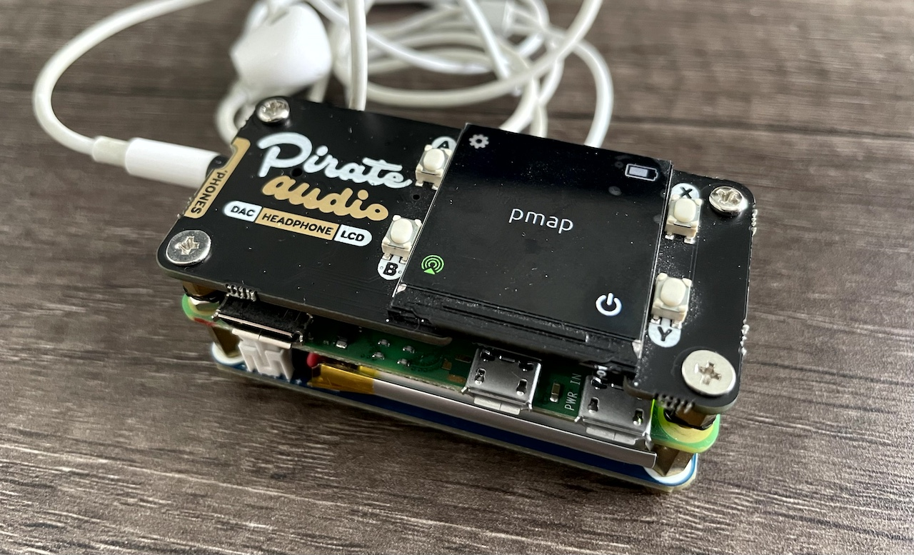

# Portable Modular Audio Player (PMAP)

PMAP is a battery-powered portable audio player built around the "[pHAT](https://www.okdo.com/blog/your-guide-to-hats-and-phats/)" form factor.

---


### Features
* Install script sets up config.txt and enables SPI and I2C automatically
* Supports AirPlay 2 using [shairport-sync](https://github.com/mikebrady/shairport-sync)
* Supports Spotify Connect using [raspotify](https://github.com/dtcooper/raspotify)
* Control AirPlay 2/Spotify Connect reciever, reboot and shutdown using buttons
* Dynamic battery icon (shows charge level + charge status)
* Settings for backlight and screen rotation
---


### The Sandwich



The basic components are stacked and connected using the 40 pin GPIO:
````
i2s DAC + Screen
------40 Pin GPIO------
Single Board Computer
------40 Pin GPIO------
Battery System
````
and then held securely using standoffs.

---


### Compatible Hardware
i2s DAC + Screen
* Pirate Audio: Headphone Amp for Raspberry Pi -> https://shop.pimoroni.com/products/pirate-audio-headphone-amp

Single Board Computer
* Raspberry Pi Zero 2 W -> https://www.raspberrypi.com/products/raspberry-pi-zero-2-w/

Battery System (Optional)
* Waveshare UPS HAT (C) -> https://www.waveshare.com/wiki/UPS_HAT_(C)

---

### Installation Guide
1. Setup Hardware using "Setup Guide" section here -> https://kavi.sblmnl.co.za/pmap/
2. Flash Raspberry Pi OS Lite (32-bit) to SD Card using Raspberry Pi Imager. Make sure WiFi settings are added, SSH is enabled and **username must be pi** (Click ⚙️ to see these options). Hostname will be used as the AirPlay 2 device name.
3. [SSH into Pi](https://www.raspberrypi.com/documentation/computers/remote-access.html#secure-shell-from-linux-or-mac-os) and run (as pi user):
````
curl -sL https://raw.githubusercontent.com/kavinaidoo/pmap/main/install.sh | sudo sh
````
---

### Main Files
* install.sh - Installs pmap and all supporting software (eg. shairport-sync)
* pmap.py - Code that runs the screen, GPIO etc.

---
### Disclaimer
**This project is in active development. Interface may change, features may change, run the install script at your own risk!**


