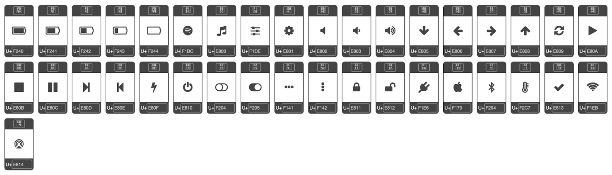

# Icons Guide

To get the icons used in PMAP, a custom font(pmap_icons.ttf) that only includes the needed icons was created. Here's how you can add a custom icon font to your project:

1. Open the amazing [Fontello - icon fonts generator](https://fontello.com/) tool.
2. Select the icons you want.
3. To add a custom icon, drag it into the "Custom Icons" section (This was used to import the [AirPlay Audio icon](https://pictogrammers.com/library/mdi/icon/cast-audio-variant/) that wasn't present)
4. Click the "Customize Codes" tab and save the Unicode code points (eg. U+E801) to your icons. (Easiest to take a screenshot and save it)
5. Adjust the icon size, change the font name and click "Download webfont" on the top right.
6. Inside the zip file will be a "font" folder that contains your font (eg. pmap_icons.ttf) in ttf format

In your code, you can add variables to represent the Unicode code points (eg. icon_settings = "\uE801"). Look inside [pmap.py](https://github.com/kavinaidoo/pmap/blob/main/pmap.py) to see how they are used.

## Current list of icons in pmap_icons.ttf

